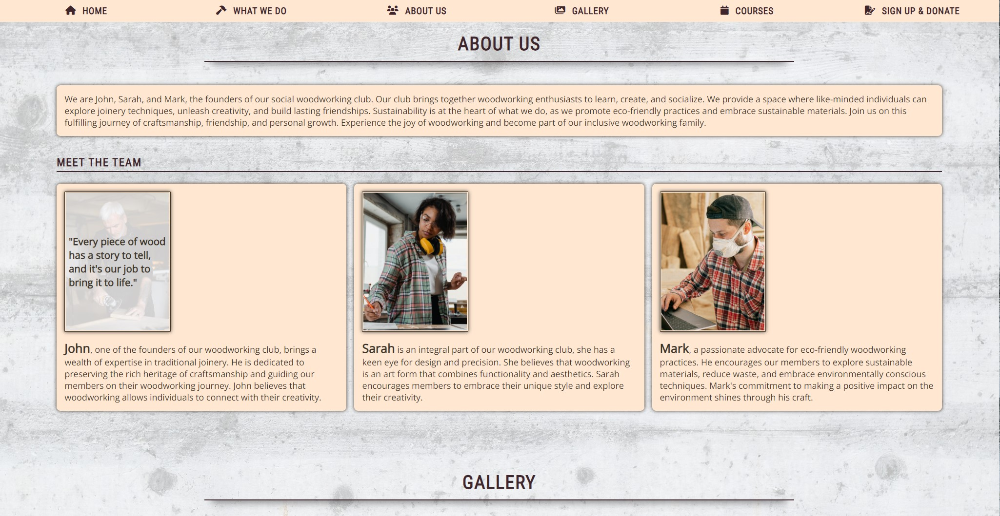

# Woodworking Club
Live Website: [Woodworking Club](https://nixts.github.io/woodworking-club/index.html)

## Purpose
Woodworking Club is a comprehensive site that provides information for individuals interested in woodworking and socializing with like-minded woodworking enthusiasts. Woodworking Club offers a diverse range of services, including beginner-courses, open workshops and exclusive member events, all under the guidance of highly skilled and experianced woodworking professionals.

With a primary focus on fostering a vibrant woodworking community, our platform appeals to seasoned craftsmen, as well as individuals with a keen interest in woodworking but limited prior experience.

At its core, this website in its current state, aims to attract new and interested members while also seeking potential donations and partnerships to keep Woodworking Club alive and thriving.

## **Features**
### **Existing Features**
+ **Navigation Bar**
  + A fully responsive navigation bar that, upon clicking, jumps to the respective section.
  + Remains fixed to the top throughout the whole site to ensure consistent and easy navigation. 

+ **The landing page image with slogan**
  + Animated Hero Image with a zoom out effect to catch the users attention upon opening the site.
  + The clubs slogan blending in after the hero images animation ends to show the core principles.

+ **What we do & Why we do it**
  + Description of what the Woodworking Club is all about, within colored text boxes to make the texts clearly separated and ease readability. 
  +  Upon reading through this section, the user will see the benefits of joining the woodworking club or making a donation.

+ **About us**
  + Showcasing the team members and their skills as well as personal goals.
  + Hovering over the images makes a personal quote of each team member blend in from the top.
  + The user will experiance a positive feeling upon seeing a very skilled and passionate team that provides guidance and expertise.

+ **Gallery**
  + A fully responsive masonry style gallery showcasing the workshop, members working on projects and the tools used.
  + These supporting images show how active and healty the community is.
  + The user will be able to easily identify the types of work and events the club puts together.

+ **Courses**
  + This section will allow the user to see exactly when and which course will happen.
  + An interactive Google map makes the location easy to find.

+ **Sign up and Donate**
  + This section will allow the user to get signed up for the different courses. The user will be able to select which course they are interested in.
  + The second section will allow the user to donate either wood/materials, money, tools or other thing to the club. A description field and image upload will make it easy to describe the specific donation.
  + The user will have to insert a full name, e-mail address and select and option, respectivly add a description or upload images.

+ **Footer**
  + The footer section includes a Back to the top button to support navigation.
  + The footer is valuable to the user as it encourages them to keep connected via different social media channels.
  + A newsletter subscription box will allow the user to reaceive a monthly newsletter.

+ **Thank you messages**
  + Upon clicking each submit button, the user will be redirected to a new site displaying a thank you message including a 'back to the homepage'-button

+ **404 Page**
  + In case of clicking on an incorrect or missing link, or typing an invalid path, the user will be redirected to a 404 - Page Not Found site, which includes 'Back to Homepage'-button for easy navigation.
  

### **Features left to implement**
+ A hamburger navigation button for easier and up-to-date navigation on smaller devices such as smartphone and tablets.
+ Scroll animation for a smooth scroll when clicking a navigation element.
+ Due to its location in the heart of switzerland, a language feature for german and french would be a huge quality of life improvement for the users
+ A color pallet for browsers using dark mode
+ Due to the limitations of html and css in this project, the following features could not be added, but would improve the quality of this site significantly:
  + A login feature, user profiles and a user database
  + Automated E-Mail responses to sign-up, donation and newsletter form
  
## Technologies

## Testing
### Strategy
### Procedure
### Test by real Users
### Test Results and Resolutions

## Deployment
### Creation
### Using Github Pages
### Run Locally

## Credits
### Content
### Media
### Acknowledgements