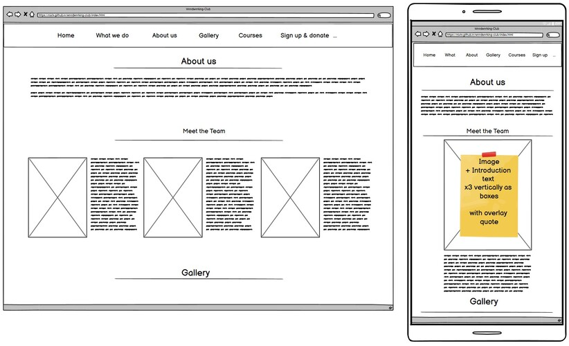
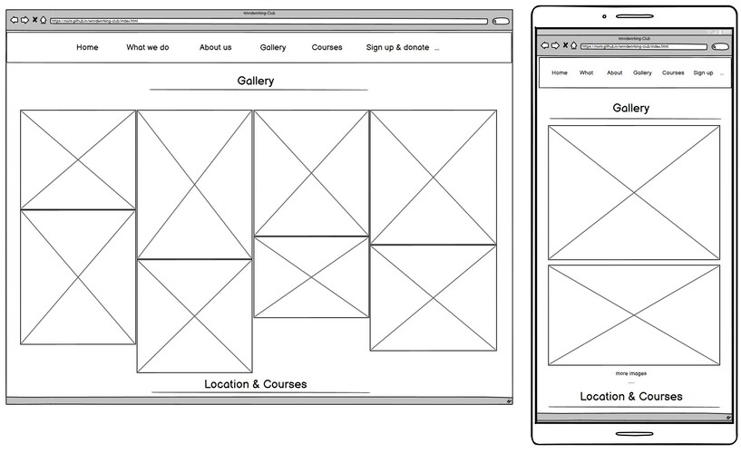
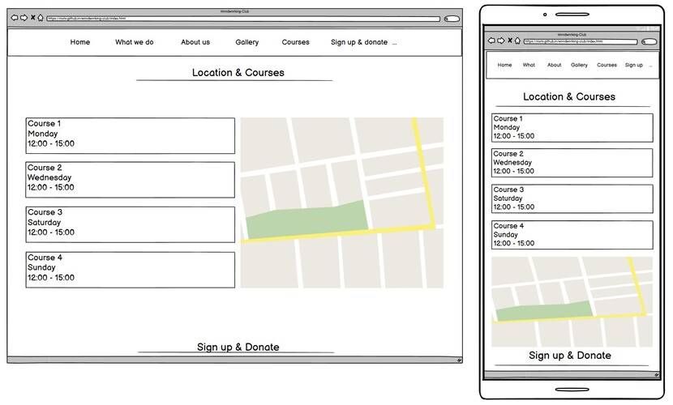
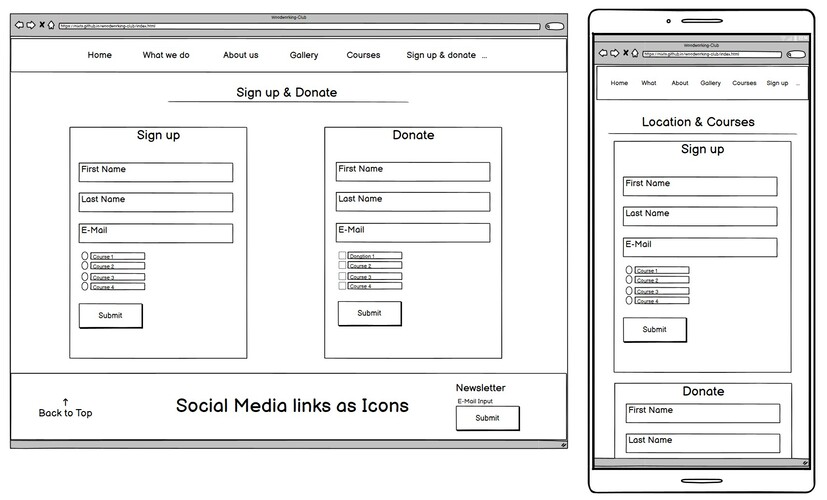
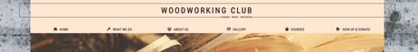
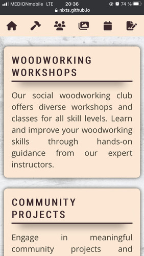
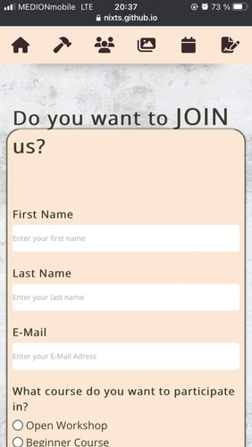

# **Woodworking Club**

Live Website: [Woodworking Club](https://nixts.github.io/woodworking-club/index.html)

***
## **Purpose**
Woodworking Club is a comprehensive website that provides information for individuals interested in woodworking and socializing with like-minded woodworking enthusiasts. Woodworking Club offers a diverse range of services, including beginner courses, open workshops, and exclusive member events, all under the guidance of highly skilled and experienced woodworking professionals.

With a primary focus on fostering a vibrant woodworking community, our platform appeals to seasoned craftsmen, as well as individuals with a keen interest in woodworking but limited prior experience.

At its core, this website, in its current state, aims to attract new and interested members while also seeking potential donations and partnerships to keep Woodworking Club alive and thriving.

***
## **User Experience Design**
### **User stories**

#### **First Time Visitor Goals**
+ As a first time user, I want to easily understand the main purpose of the site and learn more about the Woodworking Club.
+ As a first time user, I want to be able to easily navigate throughout the website to find content.
+ As a first time user, I want to view the website and content clearly on my mobile device.
+ As a first time user, I want to find ways to follow the Woodworking Club on different social media platforms.
+ As a first time user, I want to easily sign-up for courses or donate to the organization.

#### **Returning Visitor Goals**
+ As a returning user, I want to sign-up for other courses.
+ As a returning user, I want to sign-up to the Newsletter so that I am emailed any major updates and/or changes to the website or organization.

#### **Frequent Visitor Goals**
+ As a frequent user, I want to check to see if there are any new upcoming events or courses.
+ As a frequent user, I want to donate and support the woodworking club again.
+ As a frequent user, I want to check to see if there are any new photos and media from the clubs activities.

### **Structure**
The website will contain a 'About us' and a 'What we do' section with a description of the club and the current team members.
The purpose of this is to fulfill user story:
> As a first time user, I want to easily understand the main purpose of the website and learn more about the Woodworking Club.

Implementing a sticky top navigation bar with appropriate icons for each section will enhance seamless navigation across the entire website.
The Nav Menu will be collapsed on a Mobile device to only icons to make use of space on smaller devices.
The purpose of this is to fulfill user story:
> As a first time user, I want to be able to easily navigate throughout the website to find content.

Custom CSS will be used to make the website responsive by the use of media queries.

The website will be responsive and the layouts will change dependent on screen size. This is to ensure content flow is appealing,
images are displayed properly and that the content is not shrunk side by side, so small that it is unreadable.
The purpose of this is to fulfill user story:
> As a first time user, I want to view the website and content clearly on my mobile device.

The website will contain a Footer Element with Social Media Icons and a newsletter subscription form. 
The aim of the Footer elements are to fulfill user stories:
> As a first time user, I want to find ways to follow the Woodworking Club on different social media platforms. 
> As a returning user, I want to sign-up to the Newsletter so that I am emailed any major updates and/or changes to the website or organization. 
> As a frequent user, I want to check to see if there are any new upcoming events or courses.

The website will contain a sign-up and donation form for users to sign-up to course or support the club.
The purpose of this is to fulfill user stories:
> As a first time user, I want to easily sign-up for courses or donate to the organization. 
> As a returning user, I want to sign-up for other courses. 
> As a frequent user, I want to donate and support the woodworking club again.

The Gallery section will contain a Gallery with 13 photographs in each from various activities the club offers.
The purpose of these galleries are to fulfill user story:
> As a frequent user, I want to check to see if there are any new photos and media from the clubs activities. 
> As a frequent user, I want to sign-up to the Newsletter so that I am emailed any major updates and/or changes to the website or organization.

### **Design**
#### **Color Scheme**
The three main colors used are:
+ #FFE7D2 -  Light Brown, as background color for text boxes and contrast for text and content elements
+ #3F372C -  Brown, as text and border color
+ #3F262C -  Dark Brown, as header color

The website main colors are tested on the [WebAim Contrast Checker](https://webaim.org/resources/contrastchecker/) to allow visually impaired user to view the website without any issues.

  
#### **Typography**
The headers throughout the website are using the **Roboto Condenses** font while the main text is using the **Open Sans** font. 

#### **Wireframes**
Landing page 
 
What we do 
 
About us and meet the Team 
 
Gallery Page 
 
Courses Page 
 
Sign-up and Footer 
 

#### **Differences to Design**

The original design, has been changed slightly throughout the process of creating the website.

### **Limitations**

Due to no JavaScript functionality, the sign-up, Donation and newsletter Form as shown, will not store data or send email requests.

***
## **Features**
### **Existing Features**
+ Navigation Bar
  + A fully responsive navigation bar that, upon clicking, jump to the respective section.
  + Remains fixed to the top throughout the whole website to ensure consistent and easy navigation. 

+ The landing page image with slogan
  + Animated Hero Image with a zoom out effect to catch the users attention upon opening the website.
  + The clubs slogan blending in after the hero images animation ends to show the core principles.

+ What we do & Why we do it
  + Description of what the Woodworking Club is all about, within colored text boxes to make the texts clearly separated and ease readability. 
  + Upon reading through this section, the user will see the benefits of joining the woodworking club or making a donation.

+ About us
  + Showcasing the team members and their skills as well as personal goals.
  + Hovering over the images makes a personal quote of each team member blend in from the top.
  + The user will experience a positive feeling upon seeing a very skilled and passionate team that provides guidance and expertise.

+ Gallery
  + A fully responsive masonry style gallery showcasing the workshop, members working on projects and the tools used.
  + These supporting images show how active and healthy the community is.
  + The user will be able to easily identify the types of work and events the club puts together.

+ Courses
  + This section will allow the user to see exactly when and which course will happen.
  + An interactive Google map makes the location easy to find.

+ Sign-up and Donate
  + This section will allow the user to get signed up for the different courses. The user will be able to select which course they are interested in.
  + The second section will allow the user to donate either wood/materials, money, tools or other thing to the club. A description field and image upload will make it easy to describe the specific donation.
  + The user will have to insert a full name, e-mail address and select and option, respectively add a description or upload images.

+ Footer
  + The footer section includes a Back to the top button to support navigation.
  + The footer is valuable to the user as it encourages them to keep connected via different social media channels.
  + A newsletter subscription box will allow the user to receive a monthly newsletter.

+ Favicon
  + A favicon has been added to all pages to enhance recognition in the browser.

+ Thank you messages
  + Upon clicking each submit button, the user will be redirected to a new site displaying a 'thank you' message including a 'back to the homepage'-button

+ 404 Page
  + In case of clicking on an incorrect or missing link, or typing in an invalid URL, the user will be redirected to a 404 - 'Page Not Found' site, which includes a 'Back to Homepage'-button for easy navigation.

### **Features left to implement**
+ A hamburger navigation button for easier and up-to-date navigation on smaller devices such as smartphone and tablets.
+ Scroll animation for a smooth scroll when clicking a navigation element.
+ Due to its location in the heart of Switzerland, a language feature for German and French would be a huge quality of life improvement for the users
+ A color pallet for browsers using dark mode
+ Due to the limitations of HTML and CSS in this project, the following features could not be added, but would improve the quality of this website significantly:
  + A login feature, user profiles and a user database
  + Automated E-Mail responses to sign-up, donation and newsletter form

***
## Technologies
+ HTML
  + This project uses HTML as the main language used to complete the structure of the website.
+ CSS
  + This project uses custom written CSS to style the website.
+ [Font Awesome](https://fontawesome.com/)
  + Font awesome Icons are used for the Social media links contained in the Navigation and Footer section of the website.
+ [Google Fonts](https://fonts.google.com/)
  + Google fonts are used throughout the project to import the *Roboto Condensed* and *Open Sans* fonts.
+ [Codeanywhere](https://app.codeanywhere.com/)
  + Codeanywhere is a cloud-based integrated development environment (IDE) that allows developers to collaborate, write, and execute code from anywhere.
+ [GitHub](https://github.com/)
  + GitHub is the hosting website used to store the source code for the website and [Git Pages](https://pages.github.com/) is used for the deployment of the live website.
+ [Git](https://git-scm.com/)
  + Git is used as version control software to commit and push code to the GitHub repository where the source code is stored.
+ [iloveIMG](https://iloveimg.com/)
  + iloveIMG is used to compress and resize the images before being deployed to the website.
+ [Google Chrome Developer Tools](https://developers.google.com/web/tools/chrome-devtools)
  + Google chromes built in developer tools are used to inspect page elements and help debug issues with the website layout and test different CSS styles.
+ [balsamiq Wireframes](https://balsamiq.com/wireframes/)
  + This was used to create wireframes for 'The Skeleton Plane' stage of UX design.
+ [Abobe Color-wheel](https://color.adobe.com/de/create/color-wheel)
  + The Adobe Color-Wheel was used to create the color theme.
+ [WebAIM Contrast Checker](https://webaim.org/resources/contrastchecker/)
  + The WebAIM contrast checker was used to check the color theme to allow accessibility for visually impaired users.
+ [Favicon](https://favicon.io/)
  + Favicon.io was used to make the websites favicon 
+ [Techsini](http://techsini.com/multi-mockup/index.php)
  + techsini.com Multi Device website Mock-Up Generator was used to create the Mock-Up image in this README

***
## **Testing**
### **Strategy**
#### **Summary**
+ Testing is required on Woodworking Clubs responsive website.
+ This project is static and contains no back-end functionality, testing performed will be on the visual effects and layout of the website.
+ Testing is to be done on the most common browsers such as Chrome, Opera, Firefox, Safari and Edge.
+ Testing it to be done on the most common devices such as Samsung, Apple and Huawei.
+ No elements should overlap another container div. All elements should remain on the screen at all sizes above 320px.
+ All images should not stretch, pixelate or disappear on different devices, browsers or when changing the websites resolution.
+ All nav link should direct to the correct section.
+ All external links must open in a new tab.
+ Form element should open a new tab with a 'thank you' message and a 'Back to Homepage'-button.

### **Procedure**
#### **Validator testing**
+ HTML
  + No errors were returned when passing through the official [W3C Validator](https://validator.w3.org/)
    + index.html
    + signup.html
    + donation.html
    + newsletter.html
    + 404.html
  
    

+ CSS
  + No errors were returned when passing through the official [W3C (Jigsaw) Validator](https://jigsaw.w3.org/css-validator/)
    + style.css

    

#### **Responsiveness**
1. Open deployed website in Chrome browser
2. Right-clicking an element on the website
3. Select 'Inspect Element' to open Chrome Developer Tools

Test criteria are:  
+ Does each div have enough space between one another?
+ Are all images displayed correctly?
+ Are all texts and headers correctly displayed and readable?

Testing by this method is to evaluate responsiveness on various screen sizes and swiftly address bugs and errors before implementing permanent solutions.

This test was repeated using the different browsers mentioned in the summary section above

#### **Navigation and external Links**
1. Open deployed website in different browsers mentioned in the summary section above.
2. Open deployed website on different devices mentioned in the summary section above.
3. Click on each individual navigation element
4. Clicking on each external link

Test criteria are:
+ Does each navigation element jump to the corresponding section?
+ Does each section have enough space above it to not collide with the navigation bar?
+ Does each external link open a new tab?

### **Test by real Users**
To test the website in real life scenarios, a link to the deployed website has been sent out to Friends and Family with specific instructions on how to test each feature.

The tests have been conducted on the following devices:
+ iPhone 8
+ iPhone 11
+ Samsung Galaxy S14
+ Samsung Galaxy A52
+ Samsung Galaxy S10
+ Samsung Galaxy S20 FE
+ Samsung Galaxy Tab A7
+ Huawei P30

The instruction are as followed:
+ Is each element on screen and displayed correctly?
+ Does the navigation bar stick to the top and work as intended?
+ Is the Hero Image and slogan animation working?
+ Are all images displayed correctly and not stretched or blurred in any way possible?
+ Are the form elements working as intended? After filling out the form, does a new website with a 'thank you' message open?
+ Does each external social media links work?

### **Test Results and Resolutions**
The following errors were found during extensive testing:

1. On an ultrawide monitor (width 2560px and above) the logo border and logo slogan stretch too much to each side and outside the div.

    
+ This is due the width element was set to viewport-width
+ This issue has been resolved by setting a fixed with using pixels 

2. On smaller Smartphone, when clicking a navigation element, the navigation bar cuts off the header for each section.

    
+ This is due to the scroll-margin-top setting
+ This issue has been resolved by increasing the scroll-margin-top for smaller devices

3. Images in the About us section stretch when viewed on any Apple device.
   
    
+ This issue arises when the image height is not defined in the media query
+ This issue has been resolved by setting the image height to 'auto'

4. Users complained, that the text paragraphs contain big chunks of blank spaces between words.

    
+ This issue occurs because the 'text-align' property is set to 'justify', which stretches blank spaces to make the text have equal spacing on both sides
+ This issue has been resolved by setting the text-align to 'left'

5. On Apple devices, the legend text in the form elements slips out of the fieldset border

    
+ This is due to the legend texts styling 'float: left'. This styling was used to set the text withing the form elements border, which works as intended on android and Windows devices
+ This issue is resolved by setting the fieldset to position relative and the legend to position absolute

### **Unresolved Errors, Issues and Bugs**
The following errors were found during extensive testing, but have not been resolved yet:
+ There are no, to the creator of this website, known errors, issues or bugs
  
***
## **Deployment**
### **Project Creation**
The project was started by navigating to the [template](https://github.com/Code-Institute-Org/gitpod-full-template) and clicking 'Use this template'. Under Repository name I input woodworking-club and checked the 'Include all branches' checkbox. I then navigated to the new [repository](https://github.com/NixTS/woodworking-club). I then clicked the Code drop down and selected HTTPS and copied the link to the clipboard.

Opening [Codeanywhere](https://app.codeanywhere.com/) and clicking 'New Workspace', I then pasted the [repository link](https://github.com/NixTS/woodworking-club) into the URL field and clicked 'Create'. The following commands were used throughout the project:

+ git add filename - This command was used to add files to the staging area before committing.
+ git commit -m *commit message explaining the updates* - This command was used to commit changes to the local repository.
+ git push - This command is used to push all committed changes to the GitHub repository.

### **Using GitHub Pages**
1. Navigate to the GitHub [Repository:](https://github.com/NixTS/woodworking-club)
2. Click the 'Settings' Tab.
3. Scroll Down to the Git Hub Pages Heading.
4. Select 'main Branch' as the source.
5. Click the Save button.
6. Click on the link to go to the live deployed page.

### **Run Locally**
1. Navigate to the GitHub [Repository:](https://github.com/NixTS/woodworking-club)
2. Click the Code drop down menu.
3. Either Download the ZIP file, unpack locally and open with IDE (This route ends here) OR Copy Git URL from the HTTPS dialogue box.
4. Open your development editor of choice and open a terminal window in a directory of your choice.
5. Use the 'git clone' command in terminal followed by the copied git URL.
6. A clone of the project will be created locally on your machine.

***
## **Credits**
### **Content**
+ The content of this website was created by [Tobias Schmauder aka. NixTS](https://github.com/NixTS).
+ The overlay-hover animation in the About us section -> meet the team was created by my girlfriend [Valentyna](https://github.com/kayavalentina)
+ The resolution to the 'legend slips into fieldset border on Apple devices' issue has been resolved by using [Mike Harrisons](https://stackoverflow.com/users/2485833/mike-harrison) answer to a similar question on [Stackoverflow.com](https://stackoverflow.com/questions/39105300/css-can-you-positiion-a-legend-inside-a-fieldset-on-the-left-border-centered)
+ The icons in the navigation and footer were taken from [Font Awesome](https://fontawesome.com/)

### **Media**
+ All images found on this website are from [Pexels](https://www.pexels.com/)

### **Acknowledgements**
I'd like to thank my mentor Daisy McGirr for her guidance throughout my project, and mention her very helpful [Youtube](https://www.youtube.com/@IonaFrisbee) channel.

Thanks to all my testers for their time and effort to provide me with valuable feedback.

I'd also like to give a special mention to my girlfriend [Valentyna](https://github.com/kayavalentina) who provided me with feedback throughout my project. Also, her time and effort to keep errands off my shoulders, so I have more time to finish my project.
